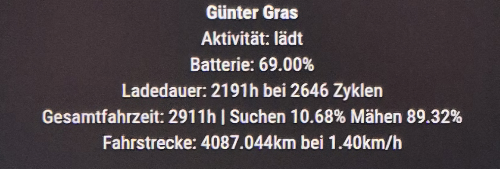

# MMM-HusqvarnaAutomower

A MagicMirror² module to display the current status of a Husqvarna Automower using the official Husqvarna Cloud API (AMC). The module uses OAuth2 with client credentials and displays e.g. mowing status, activity and battery charge (optional) directly in the mirror.

## 🧩 Functions

- Authentication via OAuth2 (client credentials)
- Automatic token renewal before expiry
- Display of (optional):
  - Name of the mower
  - Mode (e.g. “Main area”, “Parked”)
  - Error and Error code if it is on fault
  - Activity (e.g. “Mowing”, “Charging”)
  - Battery charge level
  - distance and average speed
- Simple configuration via `config.js`

## 📸 Screenshot




## 🛠️ Installation

```bash
cd ~/MagicMirror/modules
git clone https://github.com/ASteinsdoerfer/MMM-HusqvarnaAutomower.git
cd MMM-HusqvarnaAutomower
npm install

## 🔧 configuration
Change in config.js

{
  module: "MMM-HusqvarnaAutomower",
  position: "middle_center",
  config: {
    client_id: "Your Clinet ID form https://developer.husqvarnagroup.cloud/",
    client_secret: "Your client Secret from https://developer.husqvarnagroup.cloud/",
    updateInterval: 5 * 60 * 1000, // 5 minute period
	
	showBattery: true, 
	showActivity: true, 
	showCharging: true,
	showTime:true,
	showDistance:true
	
  }
 },


## 🙌 Author
ASteinsdoerfer

